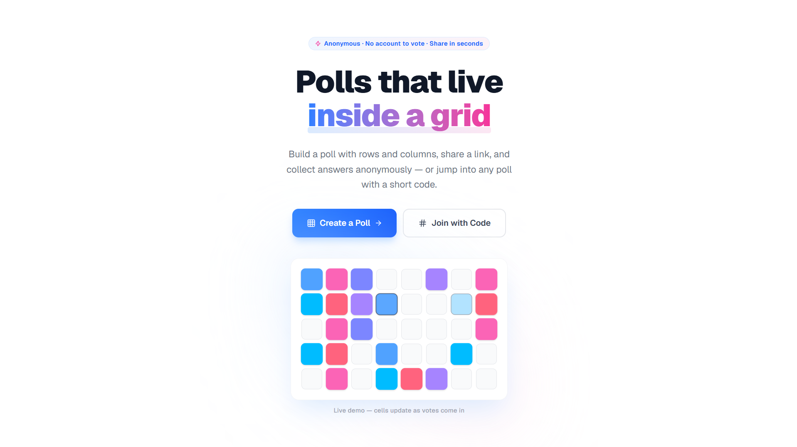
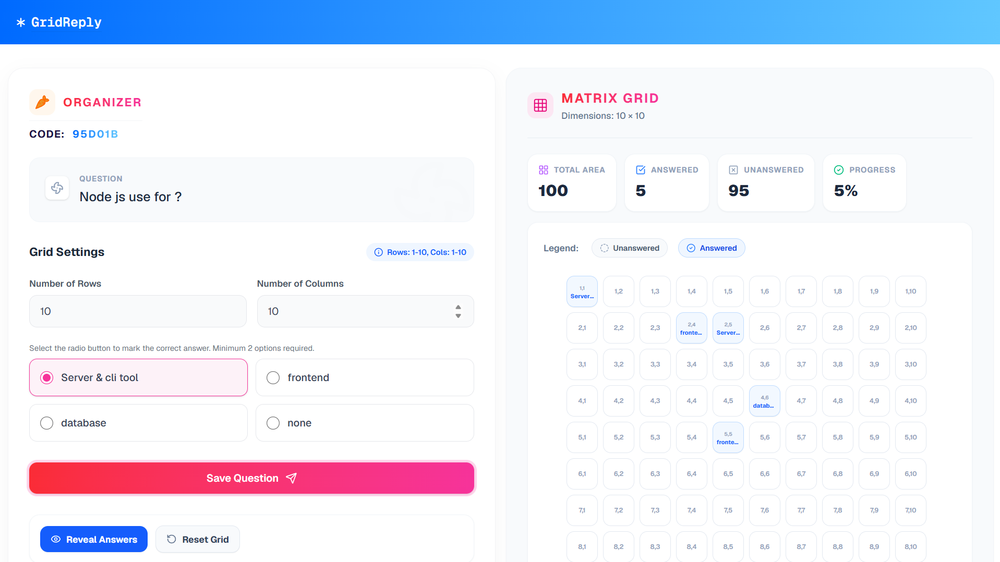

# 🎯 GridReply - Interactive Matrix Polling Platform

> **Create engaging, real-time matrix-based polls and surveys with an elegant, modern interface.**


[](https://nextjs.org/)
[](https://nodejs.org/)
[](https://socket.io/)

---

## 🌟 Features

✨ **Real-time Matrix Polls** - Interactive grid-based polling system with live updates  
🎨 **Modern UI/UX** - Beautiful, responsive design built with Tailwind CSS  
📊 **Instant Results** - See responses in real-time with color-coded grid feedback  
🔐 **Organizer Controls** - Reveal answers, reset grid, and manage polls seamlessly  
💾 **Persistent Storage** - All responses are saved and persist across page refreshes  
🚀 **Real-time Sync** - Socket.io for instant synchronization across all users  
📱 **Fully Responsive** - Works perfectly on desktop, tablet, and mobile devices  
🔄 **Session Management** - Easy session codes for participants to join  

---

## 📸 Screenshots

### 🏠 Home Page - Create or Join Polls

*Interactive landing page with animated grid and options to create new session or join existing polls*

### 👨‍💼 Organizer View - Create & Manage Polls

*Organizer dashboard for creating polls, setting grid dimensions, defining questions, and managing poll settings*

---

## 🚀 Quick Start

### Prerequisites
- **Node.js** 18+ 
- **npm** or **yarn**
- **MongoDB** (for database)

### Installation

1. **Clone the repository**
```bash
git clone https://github.com/softenrj/GridReply.git
cd GridReply
```

2. **Install dependencies**
```bash
# Install API dependencies
cd api
npm install

# Install Client dependencies
cd ../client
npm install
```

3. **Setup Environment Variables**

Create `.env.local` in the `api` directory:
```env
PORT=5000
MONGODB_URI=mongodb://localhost:27017/gridreply
JWT_SECRET=your_secret_key_here
NODE_ENV=development
```

Create `.env.local` in the `client` directory:
```env
NEXT_PUBLIC_API_URL=http://localhost:5000
NEXT_PUBLIC_SOCKET_URL=http://localhost:5000
```

4. **Start the application**

**API Server:**
```bash
cd api
npm run dev
```

**Client (in another terminal):**
```bash
cd client
npm run dev
```

Visit **http://localhost:3000** in your browser 🎉

---

## 📁 Project Structure

```
GridReply/
├── api/                          # Backend (Node.js + Express)
│   ├── src/
│   │   ├── app.ts               # Express app setup
│   │   ├── server.ts            # Server entry point
│   │   ├── router/              # API routes
│   │   ├── controller/          # Route handlers
│   │   ├── model/               # MongoDB schemas
│   │   ├── middleware/          # Custom middleware
│   │   ├── service/             # Business logic
│   │   ├── config/              # Configuration files
│   │   ├── socket.ts            # Socket.io setup
│   │   ├── sockets/             # Socket handlers
│   │   └── types/               # TypeScript definitions
│   └── package.json
│
├── client/                       # Frontend (Next.js + React)
│   ├── src/
│   │   ├── app/                 # Pages and layouts
│   │   ├── components/          # React components
│   │   ├── service/             # API & Socket services
│   │   ├── types/               # TypeScript types
│   │   └── utils/               # Utility functions
│   ├── public/                  # Static assets
│   └── package.json
│
└── README.md
```

---

## 🎯 Core Features Explained

### 1️⃣ **Create a Poll**
- Organizers set rows, columns, question, and options
- Multiple choice answers with one correct answer
- Session code auto-generated for sharing

### 2️⃣ **Participate in Polls**
- Join using session code
- Click grid cells to select position
- Choose from multiple choice options
- Responses update in real-time

### 3️⃣ **Real-time Grid Display**
- Blue cells = answered by participants
- Gray cells = unanswered
- Instant synchronization via Socket.io

### 4️⃣ **Reveal Answers**
- Organizer reveals correct answers
- Yellow highlight = correct answers
- Red highlight = wrong answers
- Participants see instant feedback

### 5️⃣ **Reset Grid**
- Clear all responses
- Start fresh with new participants
- Data persists on refresh until reset

---

## 🛠️ Technology Stack

### Backend
- **Node.js & Express** - Server framework
- **Socket.io** - Real-time communication
- **MongoDB & Mongoose** - Database & ODM
- **TypeScript** - Type safety
- **JWT** - Authentication

### Frontend
- **Next.js 14** - React framework
- **TypeScript** - Type safety
- **Tailwind CSS** - Styling
- **React Hot Toast** - Notifications
- **Lucide React** - Icons

---

## 📡 API Endpoints

### Poll Management
```
POST   /api/v1/poll/new-session          Create new session
POST   /api/v1/poll/poll                 Create poll
PATCH  /api/v1/poll/poll/:pollId         Update poll
GET    /api/v1/poll/get-poll/:code       Get poll
GET    /api/v1/poll/answers/:pollId      Get all answers
```

### Interactions
```
POST   /api/v1/poll/poll-answer/:code    Submit answer
POST   /api/v1/poll/reveal-answers/:id   Reveal answers
POST   /api/v1/poll/reset-poll/:id       Reset poll
```

---

## 🔌 Socket Events

### Client to Server
```javascript
'join_session'          - Join a poll session
'poll:get:grid'         - Request grid data
```

### Server to Client
```javascript
'joined_status'         - Confirm session join
'poll_updated'          - Poll data updated
'poll_answer'           - New answer received
'poll_reveal_answers'   - Answers revealed
'poll_reset_grid'       - Grid reset
```

---

## 🔐 Environment Setup

### Development
```bash
# API
NODE_ENV=development
PORT=5000
MONGODB_URI=mongodb://localhost:27017/gridreply
JWT_SECRET=dev_secret_key

# Client
NEXT_PUBLIC_API_URL=http://localhost:5000
NEXT_PUBLIC_SOCKET_URL=http://localhost:5000
```

### Production
Update URLs to your deployed server addresses.

---

## 📚 Usage Examples

### Creating a Poll (Organizer)
1. Click "Create New Session"
2. Fill in question, grid dimensions, options
3. Select correct answer
4. Share the session code with participants

### Joining a Poll (Participant)
1. Click "Join Session"
2. Enter session code
3. Click grid cell to select position
4. Choose your answer from options
5. See real-time results

---

## 🤝 Contributing

We welcome contributions! Please see [CONTRIBUTING.md](./CONTRIBUTING.md) for guidelines.

1. Fork the repository
2. Create feature branch (`git checkout -b feature/AmazingFeature`)
3. Commit changes (`git commit -m 'Add AmazingFeature'`)
4. Push to branch (`git push origin feature/AmazingFeature`)
5. Open a Pull Request

---

## 📋 Code of Conduct

Please read our [CODE_OF_CONDUCT.md](./CODE_OF_CONDUCT.md) to understand our community guidelines.

---

## 📄 License

This project is licensed under the Educational License - see the [LICENSE](./LICENSE) file for details.

**⚠️ Important:** This project is for **educational purposes only**. To use this project for commercial or production purposes, you must obtain explicit permission from the author.

📧 **Contact for Permission:** [rjsharmase@gmail.com](mailto:rjsharmase@gmail.com)

---

## 👨‍💻 Author

**Raj Sharma**
- 📧 Email: [rjsharmase@gmail.com](mailto:rjsharmase@gmail.com)
- 🐙 GitHub: [@softenrj](https://github.com/softenrj)

---

## 🙏 Acknowledgments

- Built with love for education and interactive learning
- Special thanks to the Next.js, Express, and Socket.io communities
- Beautiful UI inspired by modern design practices

---

## ⭐ Show Your Support

If you found this project helpful, please consider giving it a star! ⭐

---

## 📞 Support & Feedback

Have questions or suggestions? Feel free to:
- Open an [Issue](https://github.com/softenrj/GridReply/issues)
- Email: [rjsharmase@gmail.com](mailto:rjsharmase@gmail.com)
---

**Made with ❤️ by Raj Sharma**

*Last Updated: September 2026*
